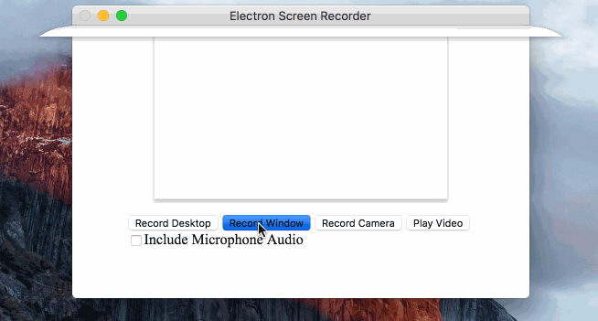

# Electron Screen Recorder

This is an electron-based screen recorder application. It uses WebRTC and
[`desktopCapture`](https://github.com/electron/electron/blob/master/docs/api/desktop-capturer.md#desktopcapturer) API for audio/video recording.

You can choose a specific screen/window to record, and the record file is saved
as `webm`.



## Using

```sh
npm install -g electron-screen-recorder
electron-screen-recorder
```

## License

[BSD](LICENSE)

## Donation

If this project helped you reduce time to develop, you can buy me a cup of coffee :)

[](https://www.paypal.com/cgi-bin/webscr?cmd=_s-xclick&hosted_button_id=CNEG9K5ARLDZU)
